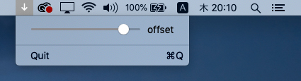

### MSL-Hydra-Synth-Player

Play the [MSL-Hydra-Synth](https://github.com/mizt/MSL-Hydra-Synth)   
(`MSL-Hydra-Synth` is Export [ojack](https://github.com/ojack) / [hydra-synth](https://github.com/ojack/hydra-synth) as Metal shader.)

The following two files uses [https://hydra-editor-v1.glitch.me/?sketch_id=example_14&code=JTJGJTJGJTIwYnklMjBPbGl2aWElMjBKYWNrJTBBJTJGJTJGJTIwJTQwX29qYWNrXyUwQSUwQW9zYygyMCUyQyUyMDAuMDElMkMlMjAxLjEpJTBBJTA5LmthbGVpZCg1KSUwQSUwOS5jb2xvcigyLjgzJTJDMC45MSUyQzAuMzkpJTBBJTA5LnJvdGF0ZSgwJTJDJTIwMC4xKSUwQSUwOS5tb2R1bGF0ZShvMCUyQyUyMCgpJTIwJTNEJTNFJTIwbW91c2UueCUyMColMjAwLjAwMDMpJTBBJTA5LnNjYWxlKDEuMDEpJTBBJTIwJTIwJTA5Lm91dChvMCk=)](https://hydra-editor-v1.glitch.me/?sketch_id=example_14&code=JTJGJTJGJTIwYnklMjBPbGl2aWElMjBKYWNrJTBBJTJGJTJGJTIwJTQwX29qYWNrXyUwQSUwQW9zYygyMCUyQyUyMDAuMDElMkMlMjAxLjEpJTBBJTA5LmthbGVpZCg1KSUwQSUwOS5jb2xvcigyLjgzJTJDMC45MSUyQzAuMzkpJTBBJTA5LnJvdGF0ZSgwJTJDJTIwMC4xKSUwQSUwOS5tb2R1bGF0ZShvMCUyQyUyMCgpJTIwJTNEJTNFJTIwbW91c2UueCUyMColMjAwLjAwMDMpJTBBJTA5LnNjYWxlKDEuMDEpJTBBJTIwJTIwJTA5Lm91dChvMCk=)

* ./assts/u0.json
* ./assts/o0.metallib

### Build Command Line Tool & Run

	$ xcrun clang++ -ObjC++ -lc++ -fobjc-arc -O3 -std=c++17 -Wc++17-extensions -framework Cocoa -framework Metal -framework Quartz -framework JavascriptCore ./libs/MetalView.mm ./Hydra-Synth-Player.mm -o ./Hydra-Synth-Player
	$ ./Hydra-Synth-Player

### Extension

`slider(value,min,max)`

Defining as follows to maintain compatibility with [hydra-synth](https://hydra.ojack.xyz).

	if(typeof(slider)==="undefined") slider=(value,min,max)=>value
	osc(50,0.1,slider(0.0,0.0,Math.PI*2.0)).out()
